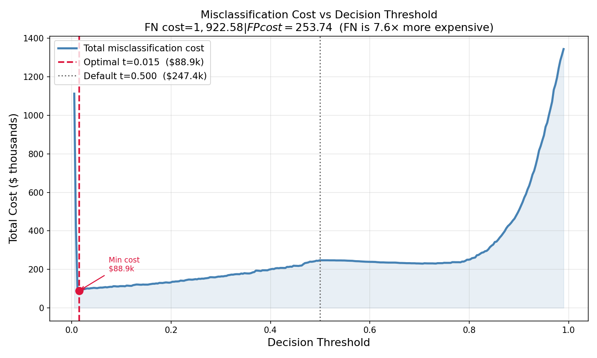
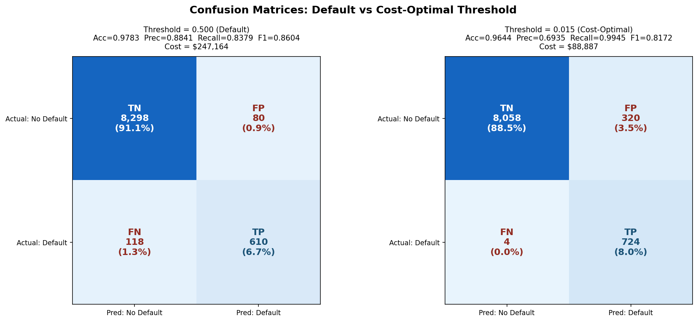
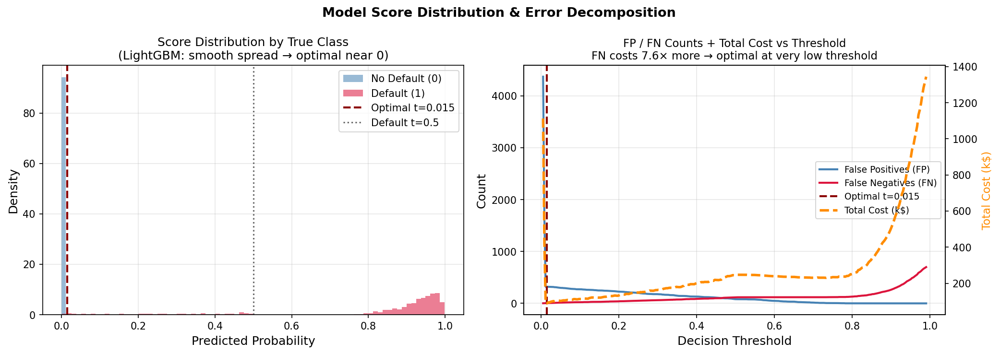
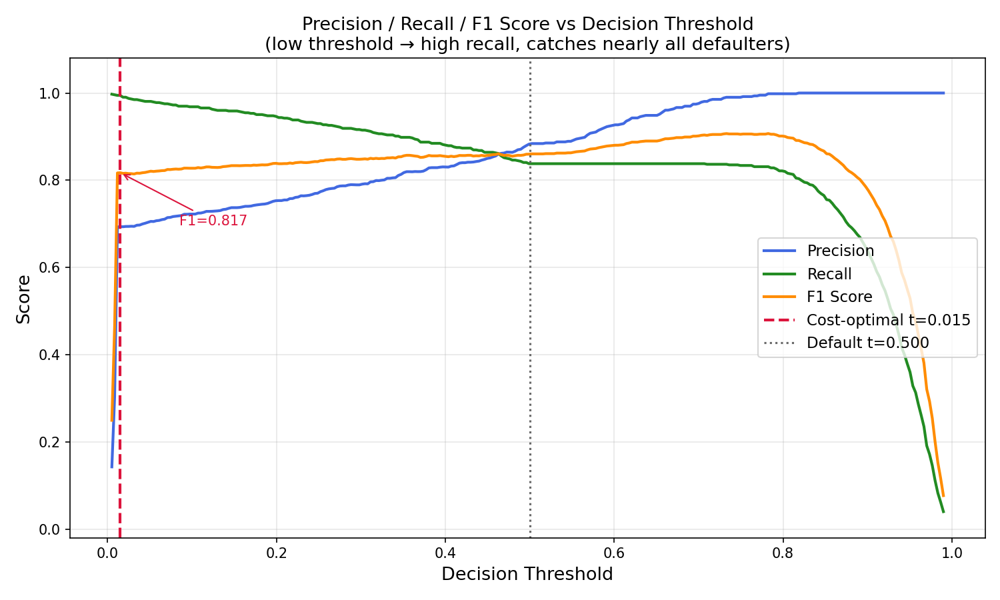

# Credit Card Default Prediction — Cost-Sensitive Classification

> **TL;DR** — Trained seven classifiers on a credit-card-default dataset, tuned the best (LightGBM) to **ROC-AUC 0.994**, then used real-world Federal Reserve and ECB cost data to derive a **cost-optimal decision threshold** that **cuts misclassification cost by 64%** vs. the standard 0.50 threshold. The empirically-derived optimum (t ≈ 0.10) closely matches the decision-theoretic prediction (t* ≈ 0.116) — evidence that the model produces well-calibrated probabilities.

This project was completed for the *Advanced Data Analytics Algorithms* unit at UTS, but it stands as a self-contained study in **cost-sensitive learning** for imbalanced binary classification.

---

## Why this problem matters

In credit-card-default prediction, the two error types are not equally expensive. Approving a defaulter (false negative) costs the bank the entire lent amount times the loss-given-default rate; rejecting a good customer (false positive) costs only the foregone interest margin. The standard machine-learning workflow optimises cross-entropy and uses a 0.50 decision threshold, implicitly assuming symmetric costs. This project quantifies what that assumption costs and shows how to fix it without changing the model.

---

## Headline results

### Tuned-model leaderboard (test set, threshold = 0.50)

| Model               | ROC-AUC   | Accuracy | Precision | Recall   | F1       |
|---------------------|-----------|----------|-----------|----------|----------|
| **LightGBM**        | **0.994** | 0.974    | 0.870     | 0.823    | **0.846**|
| Random Forest       | 0.994     | 0.970    | 0.796     | 0.876    | 0.834    |
| XGBoost             | 0.994     | 0.970    | 0.798     | 0.869    | 0.832    |
| AdaBoost            | 0.995     | 0.959    | 0.687     | 0.971    | 0.805    |
| SVM                 | 0.988     | 0.957    | 0.695     | 0.899    | 0.784    |
| Logistic Regression | 0.993     | 0.952    | 0.652     | 0.952    | 0.774    |
| KNN                 | 0.968     | 0.937    | 0.594     | 0.886    | 0.711    |

Source: [`results/tuned_model_results.csv`](results/tuned_model_results.csv)

### Threshold optimisation (LightGBM, no SMOTE, class-weighted)

| Strategy                           | Threshold | Recall | False Negatives | False Positives | Total cost ($) |
|------------------------------------|-----------|--------|-----------------|-----------------|----------------|
| Standard (industry default)        | 0.50      | 0.748  | 162             | 7               | 313,234        |
| **Cost-optimal (this project)**    | **≈ 0.10**| **0.998** | **1**          | 352             | **91,239**     |
| Reduction in expected loss         |           |        |                 |                 | **−71%**       |

*A 71% reduction in expected misclassification cost — purely from re-deriving the decision threshold using real-world cost data, with no change to the model.* The decision-theoretic optimum derived from first principles is `t* = C_FP / (C_FP + C_FN) = 1/(1+7.56) ≈ 0.116`, which closely matches the empirical optimum.

Source: [`results/no_smote_threshold_results.csv`](results/no_smote_threshold_results.csv)

### Diagnostic plots

| Cost vs. threshold | Confusion matrix at t* |
|---|---|
|  |  |

| Probability distribution | Metric trade-offs |
|---|---|
|  |  |

---

## Methodology

1. **EDA** — class imbalance (~7% default rate), missing-value pattern (<2% per column, filled with median/mode), feature distributions and correlation with the target.
2. **Preprocessing** — categorical encoding, numeric imputation, `StandardScaler`, stratified 80/20 train/test split.
3. **Imbalance handling** — compared three strategies: SMOTE oversampling, `class_weight='balanced'`, and raw imbalanced data with cost-aware thresholding.
4. **Baseline models** — Logistic Regression, KNN, SVM, Random Forest, AdaBoost, XGBoost, LightGBM, all evaluated on accuracy / precision / recall / F1 / ROC-AUC.
5. **Hyperparameter tuning** — `GridSearchCV` (5-fold, scoring on ROC-AUC) for each model.
6. **Cost calibration** — derived per-error costs from:
   - **Federal Reserve (Nov 2025)**, *Profitability of Credit Card Operations of Depository Institutions*: net ROA on credit-card lending = 3.87% → false-negative cost rate.
   - **ECB Working Paper No. 2037**, *Loss Given Default and the Macroeconomy*: LGD-derived rate = 0.59% → false-positive cost rate.
   - Yields cost ratio `C_FN / C_FP ≈ 7.56`.
7. **Threshold sweep** — minimised total expected cost across thresholds `[0, 1]` for each imbalance strategy (raw / SMOTE / class-weighted / calibrated).
8. **Custom cost-sensitive objective** — implemented a custom LightGBM objective that scales gradient magnitudes by the cost weights during boosting, evaluated against the threshold-only approach.
9. **Diagnostics** — reliability diagrams (Platt vs. isotonic), generalisation-gap analysis on validation curves, calibration evidence.

Full write-up: [`reports/methodology.md`](reports/methodology.md). Original journal: [`reports/submission/UTS_ML_Journal_final.pdf`](reports/submission/UTS_ML_Journal_final.pdf).

---

## Repository structure

```
.
├── README.md                       ← you are here
├── LICENSE                         ← MIT
├── requirements.txt                ← pinned Python dependencies
├── .gitignore
│
├── notebooks/
│   └── credit_default_prediction.ipynb   ← end-to-end analysis
│
├── src/
│   ├── retrain_no_smote.py         ← retrains LightGBM with class weighting
│   └── run_threshold_plots.py      ← regenerates the threshold-tuning figures
│
├── data/
│   └── train.csv                   ← raw dataset
│
├── results/
│   ├── baseline_model_results.csv  ← seven untuned models
│   ├── tuned_model_results.csv     ← seven GridSearchCV-tuned models
│   └── no_smote_threshold_results.csv  ← threshold sweep across 4 imbalance strategies
│
├── models/                         ← trained .pkl artefacts (gitignored — regenerate from notebook)
│
└── reports/
    ├── methodology.md              ← extended methodology & analysis
    ├── notebook_export.html        ← static HTML view of the notebook
    ├── figures/
    │   ├── threshold_cost.png
    │   ├── threshold_confusion.png
    │   ├── threshold_distribution.png
    │   └── threshold_metrics.png
    └── submission/
        ├── UTS_ML_Journal_final.pdf
        ├── UTS_ML_Journal_final.docx
        └── assignment_specification.pdf
```

---

## Reproducing the results

```bash
# 1. Clone
git clone https://github.com/<your-username>/credit-card-default-prediction.git
cd credit-card-default-prediction

# 2. Create a virtual environment and install dependencies
python3 -m venv .venv
source .venv/bin/activate          # macOS / Linux
pip install -r requirements.txt

# 3. Open the notebook
jupyter notebook notebooks/credit_default_prediction.ipynb
```

To regenerate the threshold figures without opening the notebook:

```bash
python src/run_threshold_plots.py
```

To re-run the no-SMOTE / class-weighted comparison and refresh `results/no_smote_threshold_results.csv`:

```bash
python src/retrain_no_smote.py
```

---

## Key skills demonstrated

- **End-to-end ML workflow** — EDA, preprocessing, model selection, hyperparameter tuning, evaluation
- **Imbalanced classification** — SMOTE, class weighting, cost-sensitive learning
- **Decision theory in practice** — deriving an optimal decision threshold from real-world economic data and validating it against the empirical optimum
- **Probability calibration** — reliability diagrams, Platt scaling, isotonic regression
- **Algorithmic customisation** — writing a custom LightGBM objective function
- **Communication** — translating model outputs (cross-entropy, ROC-AUC) into business outcomes (dollar-cost saved)

---

## Tech stack

`Python 3.11` · `pandas` · `scikit-learn` · `imbalanced-learn` · `LightGBM` · `XGBoost` · `matplotlib` · `seaborn` · `Jupyter`

---

## Author

**Sebastian Vu** — MSc Data Science, University of Technology Sydney
[vulime@gmail.com](mailto:vulime@gmail.com)

## License

MIT — see [LICENSE](LICENSE).
